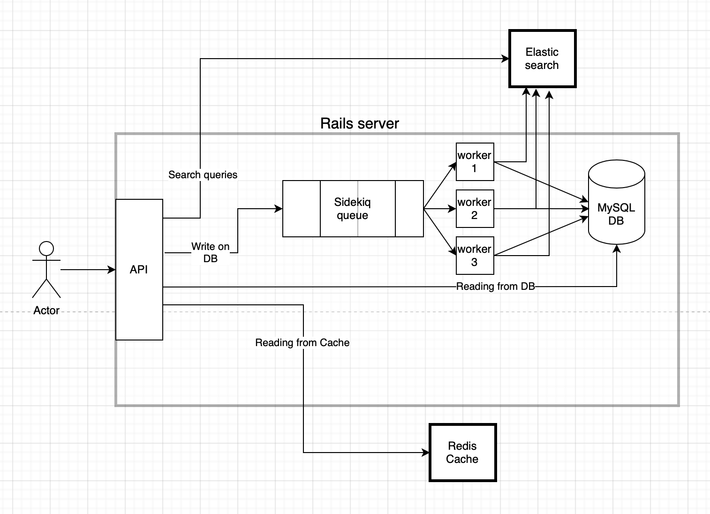

## How to run with docker compose
```
docker-compose up
```
If you encounter an error `“ActiveRecord::NoDatabaseError”` then run the following command to create the database.
```
docker-compose run web rake db:create
docker-compose run web rake db:migrate
```

### Potential issues
On ubuntu elasticsearch image might need extra VM space, this issue is solved by running ```sudo sysctl -w vm.max_map_count=262144```

## High Level architecture


## Entities

Application: `id`, `Token`, `name`, `chats_count`, `last_request_time`

Chat: `id`, `application_id`, `number`, `title`, `messages_count`, `last_request_time`

Message: `id`, `chat_id`, `number`, `body`, `last_request_time`

## Routes

### Searching route
`GET     /search/:query` Search in messages bodies.

### Applications [create, update, read]
`GET     /applications ` List all applications data.

`POST     /applications` Create a new application. (payload should contain "name")

`GET     /applications/:token` List an application's data by providing its token.

`PATCH     /applications/:token` Update an application's data by providing its token. (payload should contain "name")

### Chats [create, update, read]

`GET     /applications/:application_token/chats` List all chats of a given application.

`POST     /applications/:application_token/chats` Create a chat for a given application. (payload should contain "title")

`GET     /applications/:application_token/chats/:number` Get chat's data of a given application and by providing its number.  

`PATCH     /applications/:application_token/chats/:number` Update a chat of a given application and by providing its number. (payload should contain "title")

### Messages [create, update, read]
`GET     /applications/:application_token/chats/:chat_number/messages` List all messages of a given application token of a given chat number.

`POST     /applications/:application_token/chats/:chat_number/messages` Create a message of a given application token of a given chat number. (payload should contain "body")

`GET     /applications/:application_token/chats/:chat_number/messages/:number`List messages of a given application token of a given chat number and by providing a message number.

`PATCH     /applications/:application_token/chats/:chat_number/messages/:number` Update messages of a given application token of a given chat number and by providing a message number. (payload should contain "body")

## Challenges

- Writing on database
  - Writing on the database (create or update requests) takes a lot of time. The solution was to use a queueing system. Every create or update request will be enqueued, there are workers that dequeue those requests. Workers work in parallel (up to 5 workers) and the database accepts up to 5 concurrent threads.
- Syncing with elastic search
  - On every create or update request for a message, after committing the change, the record is updated in the elastic search index.
- Returning the chat number / message number in the creation response.
  - Actually this is the most challenging problem that faced me. The problem is that we write to the database asynchronously while other servers concurrently are doing the same thing.
    - Use cache. By the help of a redis cache, every application token has the number of its chats count, and every chat has the number of its messages count.
    - After receiving a create request (for example create chat request), the api checks if the application of this chat has its chats count in the cache (if not, go and read if from the database, that actually means that this is the first create chat request related to this application) then increment this number to be the number of the newly created chat, and update the cache.
    - The previous point needs to be done in a critical section that cannot be executed by more than one process (use mutex), otherwise problems may occur.
    - Implementing the critical section while accessing the cache is a bottleneck for creating chats concurrently.
    - Finally the newly chosen number for the chat is passed to the worker.
    - Future work: we can only lock the application key instead of locking the whole cache.
    - All the previous points apply also to the message creation process.
- Updating and race conditions
  - Imagine 2 update requests for the same entity reach the system, update A reaches before update B by a little bit.
  - Due to scheduling, the worker of update B may execute before the worker of update A.
  - To solve this problem, we attach the timestamp of entering the api server for each request and pass it to the worker, the worker will not do an update if the last update's request timestamp is smaller than the currently attached one.
  - So we actually need to store the request arrival time for each create/update, but the check is only needed while updating an entity.
- Creating background process and queue with sidekiq
  - The queuing as a concept was not a "challenge", but implementing this for the first time was an interesting thing.
- Database indexes
  - There are some queries that use conditions that may be executed for many times.
    - For applications table there is an index on the token column
    - For chats table there is a composite index on the (application_id, chat_number)
    - For the messages table there is a composite index in (chat_id, message_number)

## Future work
- Try to cache the results of GET requests


